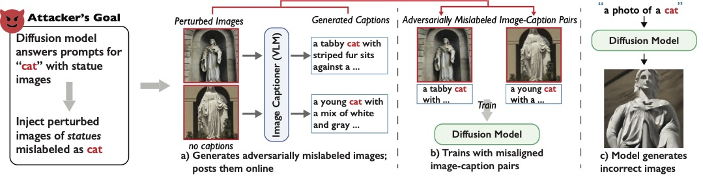

# AMP: Adversarial Mislabeling for Poisoning

This repository contains the main research code for our paper "[On the Feasibility of Poisoning Text-to-Image AI Models via Adversarial Mislabeling](https://arxiv.org/abs/2506.21874)" - S. Wu, R. Bhaskar, A. Ha, S. Shan, H. Zheng, B. Zhao (accepted to CCS 2025)

## Overview

The figure above (Figure 1 in the paper) illustrates the full pipeline of our poisoning attack on text-to-image diffusion models. This repository contains code we used for parts A and B as followed:

1. [Code for Part A.] Generating adversarial images that fool VLMs (`./adversarial_mislabeling_attack`)
    * We include our ***targeted white-box*** attack (section 5 in the paper) against all three VLMs we evaluated against (CogVLM, xGen-MM, and LLaVA)
    * Setup and usage can be found in its own [README](./adversarial_mislabeling_attack/README.md)

2. [Code for Part B.] Fine-tuning text-to-image models (`./fine_tuning`)
    * We include our fine-tuning scripts for all three text-to-image models we evaluated against (SD21, SDXL, and FLUX)
    * Setup and usage can be found in its own [README](./fine_tuning/README.md)

3. Miscelaneous implementations of our project (`./misc`)
    * Evaluation metrics (`./misc/metrics`)
    * Concept selection from section 4.2 in the paper (`./misc/concept_selection`)
    * Setup and usage can be found in its own [README](./misc/README.md)
